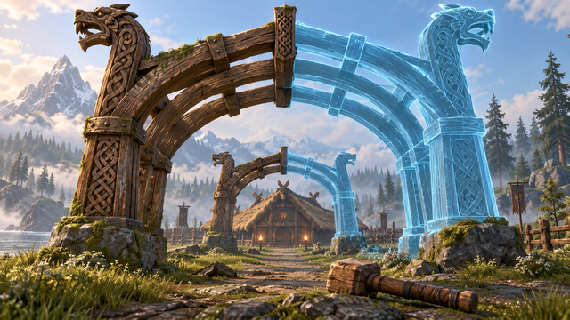
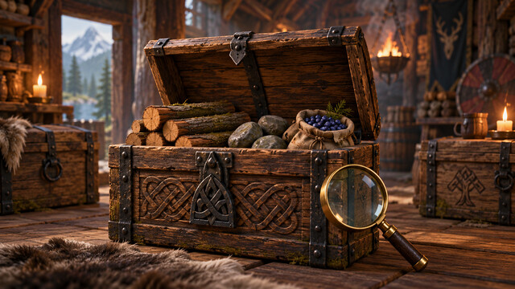
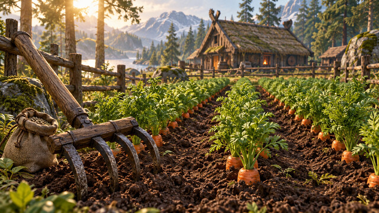
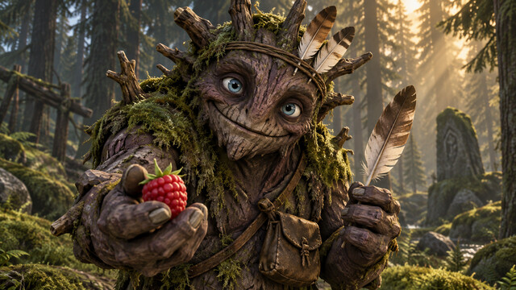
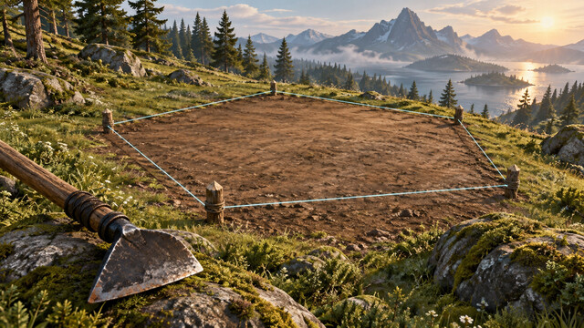
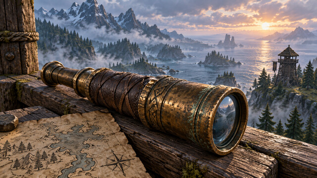
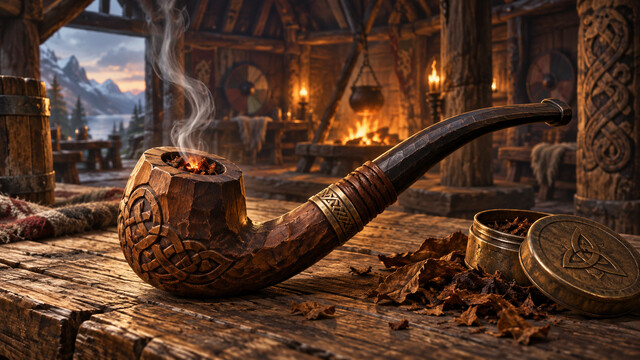

# Mod cover artwork

These illustrations were made with the built-in imagegen tool. The final generation prompts are recorded below. The original generated PNGs were exported as 640 × 360, quality-90 JPEG thumbnails with ImageMagick; no content retouching was applied.

Source thumbnails live in `mods/<Name>/cover.jpg`. Publishing copies them to `dist/<Name>.cover.jpg` and records the filename in `dist/manifest.json`. Covers are separate from the DLL/PDB install files. In game, open F7 and press **Refresh** to fetch them.

## BuildShapes

Final prompt:

Create a beautiful premium cover illustration for a Valheim game mod. WIDE LANDSCAPE 16:9 composition, intended as a 640 by 360 thumbnail displayed as small as 128 by 72. Art direction: tactile stylized Nordic fantasy, chunky low-poly forms with painterly hand-painted surfaces, weathered wood, moss and bronze, restrained earthy palette, cinematic natural light, atmospheric depth. Polished game key art, strong readable silhouette, one dominant subject centered with generous safe margins. Make the subject recognizable at tiny size. No lettering, words, logos, UI, border, watermark, neon colors or shiny plastic. Render a single complete illustration filling the frame. An impressive ornate Viking timber arch takes up most of the frame, richly carved dragon-head beam tips, warm weathered wood and a few curved ribs leading toward a small thatched longhouse. The left half of the arch is solid physical wood; its matching right half continues as a delicate translucent cyan-blue construction ghost with clearly visible individual timber beams forming the curve. A second smaller paired arch recedes behind it to suggest repeated and mirrored building pieces. A wooden builder's hammer lies in the foreground. A misty meadow and pines stay simple in the background. Beautiful practical architectural planning: satisfying curves, symmetry and craftsmanship. Cyan is used only sparingly for the ghost beams, no sci-fi screens or grids.

## ChestSearch

Final prompt:

Create a beautiful premium cover illustration for a Valheim game mod. WIDE LANDSCAPE 16:9 composition, intended as a 640 by 360 thumbnail displayed as small as 128 by 72. Art direction: tactile stylized Nordic fantasy, chunky low-poly forms with painterly hand-painted surfaces, weathered wood, moss and bronze, restrained earthy palette, cinematic natural light, atmospheric depth. Polished game key art, strong readable silhouette, one dominant subject centered with generous safe margins. Make the subject recognizable at tiny size. No lettering, words, logos, UI, border, watermark, neon colors or shiny plastic. Render a single complete illustration filling the frame. A large beautifully made Viking storage chest is the dominant foreground object: weathered oak planks, dark forged iron straps, carved knotwork, lid propped open. Inside are a neatly arranged small bundle of timber, rounded stones and a cloth pouch of blue berries, softly lit by warm amber light. A large simple brass magnifying glass with a clear circular glass lens leans against the front corner of the chest as a visual symbol of searching. Two smaller timber chests sit softly out of focus behind it in a cozy Viking storeroom, candlelight and a hint of smoky rafters. Treasure is everyday useful forest supplies, no overflowing gold coins. The chest and circular magnifying glass silhouette must be readable at tiny size.

## Farmhand

Final prompt:

Create a beautiful premium cover illustration for a Valheim game mod. WIDE LANDSCAPE 16:9 composition, intended as a 640 by 360 thumbnail displayed as small as 128 by 72. Art direction: tactile stylized Nordic fantasy, chunky low-poly forms with painterly hand-painted surfaces, weathered wood, moss and bronze, restrained earthy palette, cinematic natural light, atmospheric depth. Polished game key art, strong readable silhouette, one dominant subject centered with generous safe margins. Make the subject recognizable at tiny size. No lettering, words, logos, UI, border, watermark, neon colors or shiny plastic. Render a single complete illustration filling the frame. A cheerful productive Viking vegetable garden in a sunlit forest clearing, with three bold neat parallel rows of lush carrot greens and visible orange carrot shoulders in freshly tilled dark soil. A sturdy primitive wooden cultivator with curved forged iron tines and a small burlap seed pouch occupy the close foreground, diagonal tools framing the rows. A low split-rail fence and rustic thatched longhouse in the distance, warm golden morning sun, lush restrained green and rich earthy brown palette. Close view with large readable plants and cultivation tool, satisfying orderly crop rows sweeping into the distance. No people necessary, no machinery, no lettering.

## Gary

Final prompt:

Create a beautiful premium cover illustration for a Valheim game mod. WIDE LANDSCAPE 16:9 composition, intended as a 640 by 360 thumbnail displayed as small as 128 by 72. Art direction: tactile stylized Nordic fantasy, chunky low-poly forms with painterly hand-painted surfaces, weathered wood, moss and bronze, restrained earthy palette, cinematic natural light, atmospheric depth. Polished game key art, strong readable silhouette, one dominant subject centered with generous safe margins. Make the subject recognizable at tiny size. No lettering, words, logos, UI, border, watermark, neon colors or shiny plastic. Render a single complete illustration filling the frame. A lovable friendly greydwarf forest companion: squat sturdy humanoid made of gnarly bark and branches, muted plum-purple bark skin, large expressive pale blue eyes, a small simple twig band with three natural matte brown and cream feathers, moss on shoulders, little worn leather pouch. Gary smiles gently and offers a red raspberry in one hand, with a feather in the other. Half-body close portrait filling most of the frame, dark pine forest behind him with warm golden shafts of sunlight and soft green moss. Charming and slightly mischievous, convincingly a Valheim greydwarf rather than a human, goblin, or toy. Accessories are matte and naturally colored, never glowing.

## PolygonLeveler

Final prompt:

Create a beautiful premium cover illustration for a Valheim game mod. WIDE LANDSCAPE 16:9 composition, intended as a 640 by 360 thumbnail displayed as small as 128 by 72. Art direction: tactile stylized Nordic fantasy, chunky low-poly forms with painterly hand-painted surfaces, weathered wood, moss and bronze, restrained earthy palette, cinematic natural light, atmospheric depth. Polished game key art, strong readable silhouette, one dominant subject centered with generous safe margins. Make the subject recognizable at tiny size. No lettering, words, logos, UI, border, watermark, neon colors or shiny plastic. Render a single complete illustration filling the frame. A clearly flattened pentagonal building pad cut into an otherwise rolling grassy Nordic hillside. Low oblique view makes the smooth level earth surface and the uneven surrounding terrain unmistakable. Five simple wooden survey stakes bound the pad, linked by thin restrained pale cyan lines along the pentagon edges, showing the player's chosen polygon. A primitive wooden hoe with a forged metal blade dominates one lower foreground corner. Around the pad are gentle grassy slopes, rocks and pine trees in warm afternoon light. The pad is a clean natural earthy clearing ready for a Viking building, no building yet. Strong simple terrain geometry, tactile soil and moss, not blocky Minecraft cubes, no technical labels or diagrams.

## Spyglass

Final prompt:

Create a beautiful premium cover illustration for a Valheim game mod. WIDE LANDSCAPE 16:9 composition, intended as a 640 by 360 thumbnail displayed as small as 128 by 72. Art direction: tactile stylized Nordic fantasy, chunky low-poly forms with painterly hand-painted surfaces, weathered wood, moss and bronze, restrained earthy palette, cinematic natural light, atmospheric depth. Polished game key art, strong readable silhouette, one dominant subject centered with generous safe margins. Make the subject recognizable at tiny size. No lettering, words, logos, UI, border, watermark, neon colors or shiny plastic. Render a single complete illustration filling the frame. A primitive Viking bronze spyglass dominates the foreground, lying diagonally on a weathered timber lookout railing: elegant short tapered bronze telescope with patinated metal rings and a dark leather-wrapped grip. Beyond it a sweeping misty Nordic fjord, blue-gray sea, rocky islands, dark pines and a small distant timber watchtower. A corner of a hand-drawn parchment coastline map lies under the telescope. Dramatic cool dawn atmosphere contrasted with warm bronze highlights. The telescope is large and immediately recognizable; the scenery stays simple and secondary.

## BobsPipes

Generated with the built-in imagegen tool, exported with ImageMagick to `mods/BobsPipes/cover.jpg` (640 × 360 JPEG).

Final prompt:

Use case: stylized-concept. Asset type: cover for Bob's Pipes, a Valheim mod. Create a beautiful premium game key-art illustration in wide landscape 16:9, intended as a 640x360 thumbnail shown as small as 128x72. Tactile Nordic fantasy, chunky low-poly forms with painterly hand-painted surfaces, weathered wood and bronze, restrained earthy palette, atmospheric warm hearth light. One dominant foreground subject with generous safe margins: a gorgeous hand-carved bent wooden tobacco pipe resting diagonally on a rough oak table, a deep hollow round wooden bowl with subtle carved Norse knotwork, dark curved stem and small leather wrap, tiny warm ember inside and one delicate curl of pale smoke. A small round bronze tobacco tin and a few dry brown tobacco leaves beside it. A cozy Viking longhouse hearth softly blurred in the background, cool dark timber rafters and warm amber fire. Quiet craftsmanship and an immersive evening ritual. Strong readable pipe silhouette. No people, lettering, words, logos, UI, border, watermark, neon colors, giant flames, modern cigarette packaging or shiny plastic. Single complete illustration filling frame.
