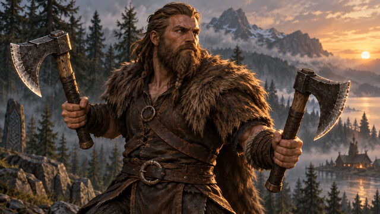
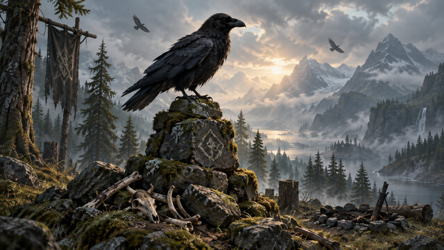
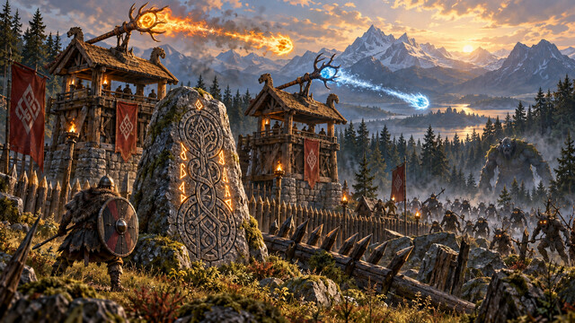
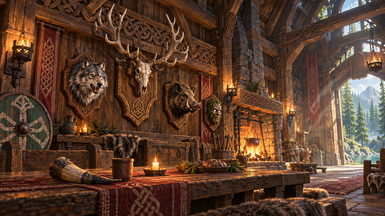

# Mod cover artwork

These illustrations were made with the built-in imagegen tool. The final generation prompts are recorded below. The original generated PNGs were exported as 640 × 360, quality-90 JPEG thumbnails with ImageMagick; no content retouching was applied.

Source thumbnails live in `mods/<Name>/cover.jpg`. Publishing copies them to `dist/<Name>.cover.jpg` and records the filename in `dist/manifest.json`. Covers are separate from the DLL/PDB install files. In game, open F7 and press **Refresh** to fetch them.

## BuildShapes

Final prompt:

Create a beautiful premium cover illustration for a Valheim game mod. WIDE LANDSCAPE 16:9 composition, intended as a 640 by 360 thumbnail displayed as small as 128 by 72. Art direction: tactile stylized Nordic fantasy, chunky low-poly forms with painterly hand-painted surfaces, weathered wood, moss and bronze, restrained earthy palette, cinematic natural light, atmospheric depth. Polished game key art, strong readable silhouette, one dominant subject centered with generous safe margins. Make the subject recognizable at tiny size. No lettering, words, logos, UI, border, watermark, neon colors or shiny plastic. Render a single complete illustration filling the frame. An impressive ornate Viking timber arch takes up most of the frame, richly carved dragon-head beam tips, warm weathered wood and a few curved ribs leading toward a small thatched longhouse. The left half of the arch is solid physical wood; its matching right half continues as a delicate translucent cyan-blue construction ghost with clearly visible individual timber beams forming the curve. A second smaller paired arch recedes behind it to suggest repeated and mirrored building pieces. A wooden builder's hammer lies in the foreground. A misty meadow and pines stay simple in the background. Beautiful practical architectural planning: satisfying curves, symmetry and craftsmanship. Cyan is used only sparingly for the ghost beams, no sci-fi screens or grids.

## ChestSearch

Final prompt:

Create a beautiful premium cover illustration for a Valheim game mod. WIDE LANDSCAPE 16:9 composition, intended as a 640 by 360 thumbnail displayed as small as 128 by 72. Art direction: tactile stylized Nordic fantasy, chunky low-poly forms with painterly hand-painted surfaces, weathered wood, moss and bronze, restrained earthy palette, cinematic natural light, atmospheric depth. Polished game key art, strong readable silhouette, one dominant subject centered with generous safe margins. Make the subject recognizable at tiny size. No lettering, words, logos, UI, border, watermark, neon colors or shiny plastic. Render a single complete illustration filling the frame. A large beautifully made Viking storage chest is the dominant foreground object: weathered oak planks, dark forged iron straps, carved knotwork, lid propped open. Inside are a neatly arranged small bundle of timber, rounded stones and a cloth pouch of blue berries, softly lit by warm amber light. A large simple brass magnifying glass with a clear circular glass lens leans against the front corner of the chest as a visual symbol of searching. Two smaller timber chests sit softly out of focus behind it in a cozy Viking storeroom, candlelight and a hint of smoky rafters. Treasure is everyday useful forest supplies, no overflowing gold coins. The chest and circular magnifying glass silhouette must be readable at tiny size.

## Farmhand

Final prompt:

Create a beautiful premium cover illustration for a Valheim game mod. WIDE LANDSCAPE 16:9 composition, intended as a 640 by 360 thumbnail displayed as small as 128 by 72. Art direction: tactile stylized Nordic fantasy, chunky low-poly forms with painterly hand-painted surfaces, weathered wood, moss and bronze, restrained earthy palette, cinematic natural light, atmospheric depth. Polished game key art, strong readable silhouette, one dominant subject centered with generous safe margins. Make the subject recognizable at tiny size. No lettering, words, logos, UI, border, watermark, neon colors or shiny plastic. Render a single complete illustration filling the frame. A cheerful productive Viking vegetable garden in a sunlit forest clearing, with three bold neat parallel rows of lush carrot greens and visible orange carrot shoulders in freshly tilled dark soil. A sturdy primitive wooden cultivator with curved forged iron tines and a small burlap seed pouch occupy the close foreground, diagonal tools framing the rows. A low split-rail fence and rustic thatched longhouse in the distance, warm golden morning sun, lush restrained green and rich earthy brown palette. Close view with large readable plants and cultivation tool, satisfying orderly crop rows sweeping into the distance. No people necessary, no machinery, no lettering.

## Gary

Final prompt:

Create a beautiful premium cover illustration for a Valheim game mod. WIDE LANDSCAPE 16:9 composition, intended as a 640 by 360 thumbnail displayed as small as 128 by 72. Art direction: tactile stylized Nordic fantasy, chunky low-poly forms with painterly hand-painted surfaces, weathered wood, moss and bronze, restrained earthy palette, cinematic natural light, atmospheric depth. Polished game key art, strong readable silhouette, one dominant subject centered with generous safe margins. Make the subject recognizable at tiny size. No lettering, words, logos, UI, border, watermark, neon colors or shiny plastic. Render a single complete illustration filling the frame. A lovable friendly greydwarf forest companion: squat sturdy humanoid made of gnarly bark and branches, muted plum-purple bark skin, large expressive pale blue eyes, a small simple twig band with three natural matte brown and cream feathers, moss on shoulders, little worn leather pouch. Gary smiles gently and offers a red raspberry in one hand, with a feather in the other. Half-body close portrait filling most of the frame, dark pine forest behind him with warm golden shafts of sunlight and soft green moss. Charming and slightly mischievous, convincingly a Valheim greydwarf rather than a human, goblin, or toy. Accessories are matte and naturally colored, never glowing.

## PolygonLeveler

Final prompt:

Create a beautiful premium cover illustration for a Valheim game mod. WIDE LANDSCAPE 16:9 composition, intended as a 640 by 360 thumbnail displayed as small as 128 by 72. Art direction: tactile stylized Nordic fantasy, chunky low-poly forms with painterly hand-painted surfaces, weathered wood, moss and bronze, restrained earthy palette, cinematic natural light, atmospheric depth. Polished game key art, strong readable silhouette, one dominant subject centered with generous safe margins. Make the subject recognizable at tiny size. No lettering, words, logos, UI, border, watermark, neon colors or shiny plastic. Render a single complete illustration filling the frame. A clearly flattened pentagonal building pad cut into an otherwise rolling grassy Nordic hillside. Low oblique view makes the smooth level earth surface and the uneven surrounding terrain unmistakable. Five simple wooden survey stakes bound the pad, linked by thin restrained pale cyan lines along the pentagon edges, showing the player's chosen polygon. A primitive wooden hoe with a forged metal blade dominates one lower foreground corner. Around the pad are gentle grassy slopes, rocks and pine trees in warm afternoon light. The pad is a clean natural earthy clearing ready for a Viking building, no building yet. Strong simple terrain geometry, tactile soil and moss, not blocky Minecraft cubes, no technical labels or diagrams.

## Spyglass

Final prompt:

Create a beautiful premium cover illustration for a Valheim game mod. WIDE LANDSCAPE 16:9 composition, intended as a 640 by 360 thumbnail displayed as small as 128 by 72. Art direction: tactile stylized Nordic fantasy, chunky low-poly forms with painterly hand-painted surfaces, weathered wood, moss and bronze, restrained earthy palette, cinematic natural light, atmospheric depth. Polished game key art, strong readable silhouette, one dominant subject centered with generous safe margins. Make the subject recognizable at tiny size. No lettering, words, logos, UI, border, watermark, neon colors or shiny plastic. Render a single complete illustration filling the frame. A primitive Viking bronze spyglass dominates the foreground, lying diagonally on a weathered timber lookout railing: elegant short tapered bronze telescope with patinated metal rings and a dark leather-wrapped grip. Beyond it a sweeping misty Nordic fjord, blue-gray sea, rocky islands, dark pines and a small distant timber watchtower. A corner of a hand-drawn parchment coastline map lies under the telescope. Dramatic cool dawn atmosphere contrasted with warm bronze highlights. The telescope is large and immediately recognizable; the scenery stays simple and secondary.

## BobsPipes

Generated with the built-in imagegen tool, exported with ImageMagick to `mods/BobsPipes/cover.jpg` (640 × 360 JPEG).

Final prompt:

Use case: stylized-concept. Asset type: cover for Bob's Pipes, a Valheim mod. Create a beautiful premium game key-art illustration in wide landscape 16:9, intended as a 640x360 thumbnail shown as small as 128x72. Tactile Nordic fantasy, chunky low-poly forms with painterly hand-painted surfaces, weathered wood and bronze, restrained earthy palette, atmospheric warm hearth light. One dominant foreground subject with generous safe margins: a gorgeous hand-carved bent wooden tobacco pipe resting diagonally on a rough oak table, a deep hollow round wooden bowl with subtle carved Norse knotwork, dark curved stem and small leather wrap, tiny warm ember inside and one delicate curl of pale smoke. A small round bronze tobacco tin and a few dry brown tobacco leaves beside it. A cozy Viking longhouse hearth softly blurred in the background, cool dark timber rafters and warm amber fire. Quiet craftsmanship and an immersive evening ritual. Strong readable pipe silhouette. No people, lettering, words, logos, UI, border, watermark, neon colors, giant flames, modern cigarette packaging or shiny plastic. Single complete illustration filling frame.

## DualWield

Final prompt:

Use case: stylized-concept. Asset type: DualWield mod-manager cover for Valheim. Create premium Nordic fantasy game key art, WIDE LANDSCAPE 16:9 composition, intended as a 640x360 thumbnail displayed as small as 128x72. Tactile chunky low-poly forms with painterly hand-painted surfaces, weathered wood, dark iron, leather and fur, restrained earthy palette, cinematic natural light, atmospheric depth. A sturdy bearded Viking warrior, waist-up three-quarter view, holds TWO DISTINCT ONE-HANDED AXES, exactly one axe in each hand. Both axes are large and unmistakably visible in the central frame: short weathered wooden handles with simple broad dark forged-iron heads, one held outward on either side of his body in a confident ready stance. His two hands are visible and grip separate axe handles. Simple leather tunic and brown fur mantle, no helmet needed. Warm late-afternoon rim light on the axe edges and warrior against a softly misty dark Nordic pine forest. Strong readable two-axe silhouette; warrior and axes dominate, all axe heads and hands inside generous safe margins, uncluttered background. Authentic grounded Viking equipment, no giant fantasy weapons. No lettering, words, logos, UI, borders, watermark, neon, shiny plastic, swords, shields, extra arms or extra weapons. Render one complete illustration filling the frame.

## Omens

Final prompt:

Use case: stylized-concept. Asset type: Omens mod-manager cover for Valheim. Create beautiful premium Nordic fantasy game key art in WIDE LANDSCAPE 16:9, intended as a 640x360 thumbnail displayed as small as 128x72. Tactile stylized low-poly forms with painterly hand-painted surfaces, weathered stone, moss and dark feathers, restrained earthy palette, cinematic natural light, atmospheric depth. An imposing black raven perched on a squat ancient moss-covered stone cairn dominates the central foreground. Raven shown in clear side silhouette with folded wings, strong curved beak, subtle natural feather highlights, watchful posture. Several stones around the foot of the cairn have fallen aside, revealing a few old pale bones as a quiet warning, no gore. Two small ravens circle overhead in distant mist. Simple Nordic pine forest behind it, a cold abandoned campfire subtly visible beside the stones. Cool muted blue-green dawn mist and a narrow shaft of soft pale amber light separate the raven silhouette from the background. Mysterious, atmospheric, grounded in folklore: signs that the wilderness has something to tell you. One strong focal subject, raven and cairn occupy most of the frame with safe margins, unmistakable readable bird silhouette at tiny size. No lettering, words, logos, UI, borders, watermark, neon, glowing eyes, magical particle effects, shiny plastic, horror gore or busy composition. Render one complete illustration filling the frame.

## Shieldwall

Replaced the live screenshot on 10 October 2026 using the built-in imagegen tool. Final generated edit exported as a 640 × 360 quality-90 JPEG with ImageMagick; source and published copies are identical.

Initial prompt:

Use case: stylized-concept. Asset type: polished 16:9 landscape cover image for Shieldwall, a Valheim Viking tower-defense mod, matching a cohesive set of richly detailed painterly Nordic game-mod covers. Create ONE wide cinematic illustration, no title, text, logo, UI or watermark. Scene: a rugged Viking timber settlement at the edge of a deep pine forest, distant Scandinavian mountains, golden late-afternoon light against cool blue forest shadows. Main focal subject: a large weathered standing Warstone in the near foreground, grey stone with carved Nordic knotwork and restrained glowing runes, grounded in grass and moss. Around and behind it, two handsome timber-and-stone defensive towers with heavy beams and carved dragon eaves; an oversized magical war stave is mounted in a stone socket atop each tower, one firing a warm amber fireball and the other a cool icy-blue projectile toward an approaching forest horde. Readable silhouettes of greydwarf creatures and one distant troll beyond a wooden palisade establish the tower-defense story without clutter or gore. A small Viking defender with a round wooden shield provides scale beside the Warstone. Viking materials: hand-hewn oak, rough stone, carved interlace, wrought iron, thatched roofs, muted red wool banners. Style: premium painted fantasy game key art, tactile crafted materials, gently faceted Valheim-inspired forms, vivid natural colors, crisp focal details, atmospheric background. Clear strong composition that remains legible as a small 640x360 thumbnail, with the Warstone and tower staves prominent; artwork fills the whole frame. Magic is localized and restrained, never neon magenta. Avoid a modern castle, firearms, polished sci-fi surfaces, giant decorative text, cropped main objects, photo realism and generic flat icons.

Final edit prompt, using the initial generated image:

Precise-object-edit of this Shieldwall cover: change ONLY the two weapons mounted on top of the towers. They currently look like short-barreled cannons. Replace each with a clearly recognizable large magical war STAFF: a slender, long carved wooden shaft held in a stone socket on the tower roof, inclined toward the attackers, with an ornate antler-like or wrought-iron pronged head surrounding a glowing amber orb on the left tower and an icy-blue crystal on the middle tower. They should visibly read as Viking sorcerer staves, not firearms, cannons, artillery, or technological turrets. Retain the existing fire and frost projectile trails, originating from the staff heads. Preserve the entire rest of the illustration: the central carved Warstone, Viking defender, round shield, two carved timber towers, red banners, forest horde and troll, palisade, sunset, fjord, mountains, painterly style, material detail, colors, wide 16:9 composition and camera position. No text or logo. This is a cohesive Valheim mod-manager cover image.

## TrophyHall

Added the missing cover on 10 October 2026 using the built-in imagegen tool. Exported as a 640 × 360 quality-90 JPEG with ImageMagick; source and published copies are identical.

Final prompt:

Use case: stylized-concept. Asset type: one 16:9 landscape mod-manager cover for TrophyHall, matching richly illustrated Viking / Valheim-inspired game-mod covers. Create a premium painterly fantasy-game illustration of a beautiful, cozy Nordic longhouse trophy hall. No text, titles, logos, UI or watermark. The main subject is a richly carved oak trophy wall beneath massive interlaced timber beams: a magnificent stag skull and antlers on a wooden mounting plaque, a grey wolf head trophy, a wild boar head trophy, and a smaller mossy greydwarf mask displayed on distinct wooden item stands. Tasteful hunting trophies, no blood, gore or grotesque horror. They must be prominent, recognizable and readable at a small 640x360 thumbnail. A long wooden feasting table in the lower foreground holds a drinking horn, simple clay cup and a small candle; a welcoming hearth glows beside the wall. Decorate sparingly with a round painted wooden shield, muted red woven cloth, wrought-iron sconces and Nordic knotwork. Soft golden light from the hearth and sunbeams from a high open doorway illuminate carved wood, smoke motes and stonework; a glimpse of cool green pine forest beyond the doorway gives color contrast. Style: polished painted game key art with tactile hand-hewn timber, richly sculpted carvings and gently faceted Valheim-inspired shapes; cohesive with illustrated mod covers depicting Nordic mountains, meadow flowers, carved building arches and crafted wooden tools. Wide composition filling the frame, clear focal hierarchy, inviting warm amber and walnut tones against cool forest-green accents, detailed foreground with quieter background. Avoid photo realism, a generic medieval castle, Victorian furniture, modern objects, neon magic, tiny clutter, duplicate antlers, giant monsters, additional lettering or decorative frames.
