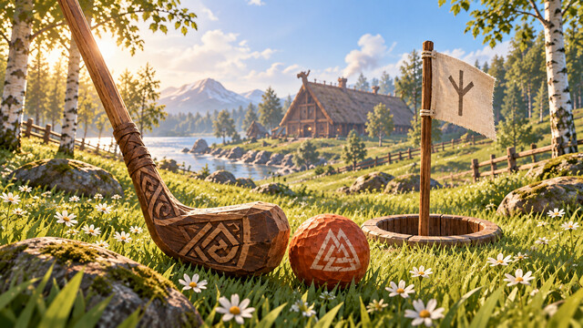

# Meadow Golf

Build a course through a meadow, across wooden ramps, around your longhouse, or down in a basement. The ball uses real surfaces; the cup leaves the ground intact.

Install on **the host and every player**, then **restart Valheim** before loading a world.

| Craft / build | Cost | Where |
| --- | --- | --- |
| Meadow golf club | 6 wood, 2 leather scraps | Workbench |
| Golf tee | 2 wood | Hammer → Furniture |
| Golf cup & flag | 4 wood, 1 stone | Hammer → Furniture |

1. Place a tee and cup. The default pair is `Meadow:1:3`. The builder can **Shift+E** each marker to set `Course:Hole:Par`; match course and hole on both ends. Par comes from the tee. Use distinct hole numbers for multiple cups. The cup must be loaded and within 240 m when starting.
2. Equip the club and **E** at the tee. Your own painted ball appears just ahead of it.
3. Stand within 3 m of the settled ball and aim using the camera. **Mouse wheel** selects Drive, Chip or Putt. **Hold left mouse** to charge (1.4 seconds to full strength), **release** to swing. Right click cancels a charge. Try low-power putts first. The amber path and end ring predict flight, bounces and settling; the HUD labels the predicted range and the power it was calculated for. Cup distance is labeled separately. The ball launches on the native swing animation’s contact event, with a wood-on-wood impact and quieter bounce sounds.
4. A slow ball at the linked cup finishes the hole. **G** shows nearby golfers' scores. **E** at the next tee continues the course.

**E on your ball** returns it to its last lie, costing one stroke. **E at the same unfinished hole's tee** returns to that tee, also costing one stroke. **Ctrl+E at a tee** starts a fresh round. Replaying a finished hole replaces that hole's score. Switching course names clears the prior course card. Up to 18 holes, par 2–8, and 99 strokes per hole. The current card saves in your ball's world data; golfers within 120 m appear on the scorecard. G is configurable in F7. While charging, prediction updates in small batches; the percentage beside its distance is the sampled strength, while the charge bar shows your current strength. A short direction line appears when a moving surface or a bounded prediction cannot give a reliable stopping point.

Balls do no combat damage, and players, Gary, other creatures and other balls pass through them. Only your own ball accepts your shots. The host creates one ball per player; the native network owner simulates its physics. Replicas remain kinematic, with Valheim's transform sync. Cup capture checks the exact linked cup, horizontal/vertical proximity and speed, so flyovers and cups on other storeys do not count. No terrain is changed.

F6 cancels a charging swing, closes the HUD and reattaches custom scripts without deleting saved objects. During the unload gap, balls freeze and their native synchronizers pause. The first installation still requires every participant to restart. Golf keeps loaded-instance lists; the only scene scan is at hot reload, and the host indexes saved balls once per world/reload in yielding batches. No repeating whole-world scans. Aim prediction uses a private Unity physics scene and discovers only colliders along the swept ball path. It copies no gameplay or network components, budgets work to roughly 2 ms per frame (an individual native physics call can take longer), caches surface shapes, and caps prediction at 24 simulated seconds, 100 m horizontally, 40 m vertically, 128 colliders per step and 1,024 cached surfaces. The private scene is unloaded when Golf unloads.

No other mod is required. There is no controller shot interface or Gary caddie behavior in this first release.

The cup carries a 3.3-metre wooden flagstaff and a broad red swallowtail banner with an ivory rune. Existing tees and cups keep their labels and match data when their models update on reload.

## Validation

Compiled against the native Linux game with mise-managed .NET 10.0.300, targeting .NET Framework 4.8. Rule tests cover label matching/rejection, all shot-power bounds, slow cup entry versus fast flyovers and vertical mismatch, bounded 18-hole scorecards, replay, course changes, fresh rounds and exact one-stroke tee penalties. The API checker resolves all native member references and checks private synchronization fields and Harmony hooks. Native Creative playtests passed for player-driven shots, cup completion, saved scorecard/replay and Golf-only reloads. Isolated floor, basement-ceiling and ramp fixtures matched actual endpoints; a live hall ricochet differed by 2.3 mm. Wind-up held the ball stationary, the animation contact launched it about 0.47 seconds after release, and native swing/impact audio reported playing. See [VALIDATION.md](VALIDATION.md). Remote multiplayer, disconnect/ownership transfer and latency remain untested.

```sh
mise exec -- dotnet build mods/Golf -c Release --nologo -p:DeployToGame=false
mise exec -- dotnet run --project tests/Golf.Tests -c Release
mise run verify
```

First Creative checks: craft/equip the club and check its grip; build a matching tee/cup; play drives, chips and delicate putts; try ramps, stairs and basement floors; check cup completion and G; return to the last lie/tee and check the single penalty; replay/new round; reload while idle/charging/rolling. With every peer installed, check each golfer can only hit their ball, remote flight is visible, score totals agree, ownership transfer after disconnect works, and a next-hole request immediately after putting preserves the completed result.

Optional **ClaudeTools** commands: `golf reload` reloads only Golf in local Creative; `golf card open|close` operates the scorecard. `golf predict <mode> <power> <dx> <dz>` inspects a prediction. Creative-only `golf playtest <mode> <power> <dx> <dz>` compares a disposable physics ball against it without changing your real score; `golf fixture floor|basement|ramp` builds temporary unsaved collision fixtures far above/below play and cleans them up, including on reload. `golf starttest` starts the nearest tagged test tee. `golf animation` and `golf listen` inspect native contact events and sound playback. Other commands: `golf status`, `golf shot drive|chip|putt <power=0..1> <dx> <dz>`, `golf testcourse <length=2..30>`, `golf testclear`. Status is read-only; shots need the equipped club and a nearby stationary own ball. Testcourse/testclear require the locally hosted world named Creative; they add/remove only tagged test tees/cups, never terrain or existing buildings. Start the test hole with E. Clear a previous test pair before creating another with the same label.



## Matches and terrain (0.2.0)

Equip the club and press **G** near hole 1. **1** starts nine holes, **2** starts eighteen,
**J** joins an open match, **X** stops your round, and **M** ends the shared match for its starter,
the first tee's builder or the server host. **R** refreshes scores. E at each next tee continues.
Every hole needs exactly one tee and one cup named `Course:Hole:Par`. The host validates the
whole saved course; distinct course names separate layouts. An eighteen-hole layout supports
nine-hole matches too. Finished cards survive stops and reloads. Starting another round replaces
your prior card; restarting within the same match is prevented.

Uncleared grass, forest rough, swamp mud and snow slow the ball; hoe-cleared surfaces and built
floors roll farther. Trees, rocks, structures and slopes use their real collision geometry.
Entering water costs +1 and returns to the last lie. A blue predicted path warns of water entry.
The preview and live ball share these rules, including wave-independent liquid levels.

The panel uses the game's inventory wood artwork, recessed frame and Averia font. Keyboard
controls keep the native cursor state intact; normal player controls pause while the card is open.
